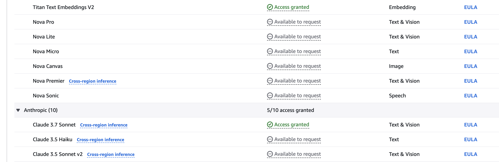

# Building Generative AI application RAG with Amazon Aurora and Amazon Bedrock Knowledge Base

Amazon Bedrock is the easiest way to build and scale generative AI applications with foundational models (FMs) on AWS.
FMs are
trained on vast quantities of data, allowing them to be used to answer questions on a variety of subjects. However, if
you want to use an FM to answer questions about your private data that you have stored in your Amazon Simple Storage
Service (Amazon S3) bucket or Amazon Aurora PostgreSQL-Compatible Edition database, you need to use a technique known as
Retrieval Augmented Generation (RAG) to provide relevant answers for your customers.

### Architecture


As the test file, PostgreSQL PDF tutorial is used.

### Requirements

* [Create an AWS account](https://portal.aws.amazon.com/gp/aws/developer/registration/index.html) if you do not already
  have one and log in. The IAM user that you use must have sufficient permissions to make necessary AWS service calls
  and manage AWS resources.
* [AWS CLI](https://docs.aws.amazon.com/cli/latest/userguide/install-cliv2.html) installed and configured
* [Git Installed](https://git-scm.com/book/en/v2/Getting-Started-Installing-Git)
* [Terraform](https://developer.hashicorp.com/terraform/tutorials/aws-get-started/install-cli) installed

## Amazon Bedrock setup instructions

You must request access to a model before you can use it. If you try to use the model (with the API or console) before
you have requested access to it, you receive an error message. For more information,
see [Model access](https://docs.aws.amazon.com/bedrock/latest/userguide/model-access.html).

1. In the AWS console, select the region from which you want to access Amazon Bedrock. We recommend to use us-east-1 (N.
   Virginia) region where all Bedrock models are available.
   
   

2. Find **Amazon Bedrock** by searching in the AWS console.

   

3. Expand the side menu and select **Model access**.

   

4. Select the **Edit** button.
5. Use the checkboxes to select the models you wish to enable. This guideline requires **Titan Text Embeddings V2** and
   **Claude 3.5 Sonnet** models. Click **Save
   changes** to activate the models in your account. Please feel free to
   experiment with other models if you want to.
6. Wait until the models become available.

   

## Deployment

1. Create a new directory, navigate to that directory in a terminal and clone the GitHub repository:
   ```bash
   git clone git@github.com:set-university/genai-workshops.git
   ```
2. Change directory to the pattern directory:
    ```bash
    cd Building\ GenAI\ application\ with\ AWS\ Workshop
    ```
3. Init terraform:
    ```bash
    terraform init
    ```
4. Download terraform modules:
    ```bash
    terraform get
    ```
5. Deploy the infrastructure:
    ```bash
    terraform plan
    terraform apply --auto-approve 
    ```
6. If needed, customize Terraform variables using custom .tfwars file
7. Wait until it's complected. It takes approximately 15 minutes.
8. After deployment completes, take a look at the Outputs section. There will be 'lambda_function_url ' entry containing
   the Lambda URL to
   test the infrastructure. Copy that URL as you'll need it for your tests.

## Sync the Bedrock knowledge base with the datasource in S3

1. Go to Bedrock service in AWS console.
2. Click **Knowledge bases** left nav menu item.
3. Click the knowledge base created via Terraform.

   

4. Select the S3 data source and click ***Sync** button.

   

5. Wait for the sync completion (~ 5-10 minutes).

## Testing

Follow the example below and replace `{your-lambda-url}` with your Lambda url from step 8 of Deployment.

```bash
 curl -X POST 'https://{your-lambda-url}/' \
   -H 'content-type: application/json' \
   -d '{ "prompt": "Describe how pg_stat_io tracks I/O activity in PostgreSQL." }'
```

The response might look like as follows:

```text
{"genai_response": "Current PostgreSQL version numbers consist of a major and a minor version number. For example, in version 10.1, 10 is the major version and 1 is the minor version. This indicates it's the first minor release of major version 10.\n\nFor PostgreSQL versions before 10.0, the version numbers consisted of three numbers, such as 9.5.3. In these cases, the major version is represented by the first two digit groups (e.g., 9.5), and the minor version is the third number (e.g., 3).\n\nMinor releases are always compatible with earlier and later minor releases of the same major version. For instance, version 10.1 is compatible with 10.0 and 10.6. Similarly, 9.5.3 is compatible with 9.5.0, 9.5.1, and 9.5.6."}
```

## Cleanup

1. Run terraform destroy command.
    ```bash
    terraform destroy
   # type 'yes' to confirm
    ```
2. Wait until the AWS infrastructure will be destroyed (~ 10-15 minutes).

## Extra Resources

* [Retrieve data and generate AI responses with knowledge bases](https://docs.aws.amazon.com/bedrock/latest/userguide/knowledge-base.html)
* [Terraform docs](https://developer.hashicorp.com/terraform/docs)